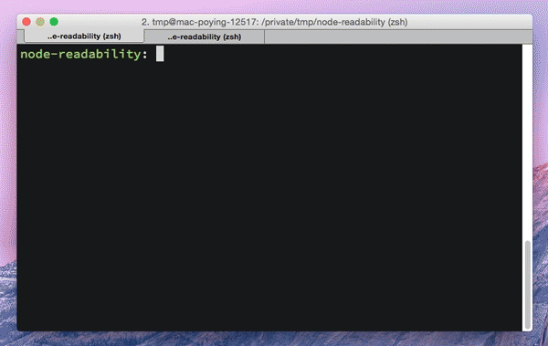

readability-api
===============

```bash
$ git clone https://github.com/poying/readability-api.git
$ cd readability-api
$ npm install
$ POER=3000 npm start
$ http://localhost:3000/?fetch_url=https://www.twreporter.org/a/opinion-scandinavia-refugee 
```


